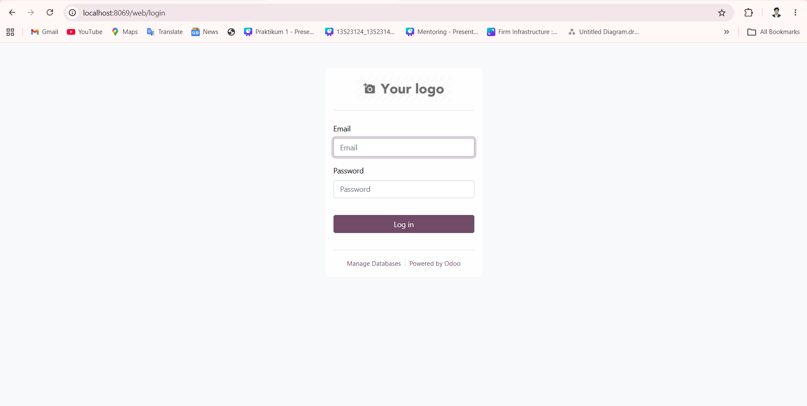

# Sistem Dashboard Terintegrasi Bootcamp Fapet Unpad

## Kelompok dan Identitas

* **Nomor Kelompok:** G08
* **Nomor Kelas:** K03

### Anggota Kelompok

| NIM      | Nama                       |
| -------- | -------------------------- |
| 13523129 | Ivant Samuel Silaban       |
| 13523144 | Muhamad Nazih Najmudin     |
| 13523124 | Muhammad Raihaan Perdana   |
| 13523156 | Hasri Fayadh Muqaffa       |
| 13523150 | Benedictus Nelson          |
| 13523138 | Samantha Laqueenna Ginting |

---

# Nama Sistem dan Perusahaan

## Nama Sistem

**Sistem Dashboard Terintegrasi Bootcamp Fapet Unpad**

## Nama Perusahaan

**Bootcamp Fapet Unpad**

---

# Deskripsi Sistem

Sistem Dashboard Terintegrasi Bootcamp Fapet Unpad merupakan sistem informasi berbasis dashboard yang dirancang untuk membantu proses monitoring operasional, pengelolaan keuangan, pengadaan bahan baku, pengukuran KPI, serta sinkronisasi data transaksi Point of Sale (POS) pada Bootcamp Fapet Unpad. Sistem ini dibangun menggunakan platform Odoo dan mengintegrasikan berbagai data operasional perusahaan ke dalam satu sistem terpusat yang mudah digunakan oleh berbagai divisi perusahaan.

Melalui sistem ini, pengguna dapat memantau kondisi bisnis secara real-time melalui dashboard interaktif yang menampilkan statistik keuangan, pengadaan, dan performa KPI perusahaan. Selain itu, sistem juga menyediakan fitur input biaya operasional, pengelolaan stok bahan baku, sinkronisasi transaksi POS, serta manajemen hak akses berbasis role (Role-Based Access Control / RBAC). Dengan adanya sistem ini, proses pengambilan keputusan menjadi lebih cepat, efisiensi operasional meningkat, serta mendukung transformasi digital dan standarisasi operasional perusahaan.

---

# Cara Menjalankan Sistem

## 1. Clone Repository

```bash
git clone https://github.com/Inforable/IF3141-odoo-K03-G08.git
cd IF3141-odoo-K03-G08
```

Expected Result:

* Source code berhasil terunduh ke komputer lokal.

---

## 2. Jalankan Docker Container

```bash
docker compose up -d
```

Expected Result:

* Container Odoo dan PostgreSQL berhasil berjalan.

---

## 3. Akses Sistem Odoo

Buka browser dan akses:

```text
http://localhost:8069
```

Expected Result:

* Halaman login sistem berhasil ditampilkan.



---

## 4. Login ke Sistem

Masukkan username dan password sesuai role pengguna.

Expected Result:

* Pengguna berhasil masuk ke Dashboard Utama.


---

## 5. Mengakses Dashboard Keuangan

Klik menu **Dashboard Keuangan** pada sidebar.

Expected Result:

* Statistik dan visualisasi keuangan tampil secara real-time.


---

## 6. Mengakses Dashboard Pengadaan

Klik menu **Dashboard Pengadaan** pada sidebar.

Expected Result:

* Informasi stok dan pengadaan bahan baku berhasil ditampilkan.


---

## 7. Mengakses Dashboard KPI

Klik menu **Dashboard KPI** pada sidebar.

Expected Result:

* Statistik KPI dan progress pencapaian divisi berhasil ditampilkan.


---

## 8. Input Biaya Operasional

Klik menu **Input Biaya Operasional**.

Expected Result:

* Form input biaya operasional berhasil ditampilkan dan data dapat disimpan.


---

## 9. Input Stok Bahan Baku

Klik menu **Input Stok Bahan Baku**.

Expected Result:

* Form input stok bahan baku berhasil ditampilkan.


---

## 10. Input Target KPI

Klik menu **Target KPI**.

Expected Result:

* Form input target KPI berhasil ditampilkan.


---

## 11. Sinkronisasi POS

Klik menu **Sinkronisasi POS**.

Expected Result:

* Statistik sinkronisasi POS dan tombol sinkronisasi manual berhasil ditampilkan.


---

## 12. Kelola Hak Akses

Klik menu **Kelola Hak Akses**.

Expected Result:

* Halaman pengelolaan user dan role berhasil ditampilkan.


---

# Kredensial Role Pengguna

| Role | Username | Password |
|---|---|---|
| Direktur | direktur | direktur123 |
| Kepala Keuangan | keuangan | keuangan123 |
| Manajer Operasional | manajer | manajer123 |
| Kepala Prosesing | prosesing | prosesing123 |
| Kepala Produksi | produksi | produksi123 |
| Staff IT | it | it123 |
| Staff Marketing | marketing | marketing123 |
| Staff Pelayanan | pelayanan | pelayanan123 |

> Catatan: Hak akses tiap akun telah disesuaikan dengan Role-Based Access Control (RBAC) yang diimplementasikan pada sistem.

---

# Kesimpulan dan Saran

Sistem Dashboard Terintegrasi Bootcamp Fapet Unpad berhasil mengintegrasikan proses monitoring operasional, pengelolaan keuangan, pengadaan bahan baku, KPI, serta sinkronisasi POS ke dalam satu sistem informasi terpusat berbasis dashboard. Implementasi sistem ini membantu meningkatkan efisiensi operasional, mempercepat pengambilan keputusan, dan meningkatkan transparansi data perusahaan secara real-time.

Untuk pengembangan selanjutnya, sistem dapat ditingkatkan dengan integrasi mobile application, notifikasi otomatis berbasis event, analitik prediktif, serta integrasi cloud deployment agar sistem lebih scalable dan mendukung ekspansi bisnis perusahaan di masa mendatang.
